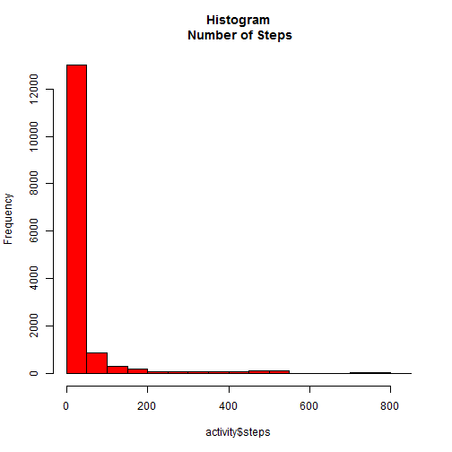
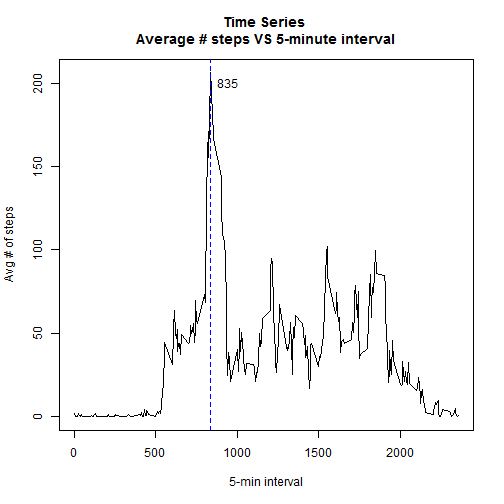
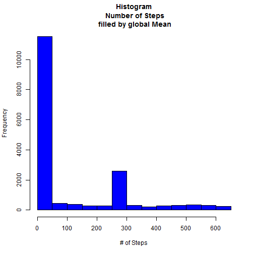
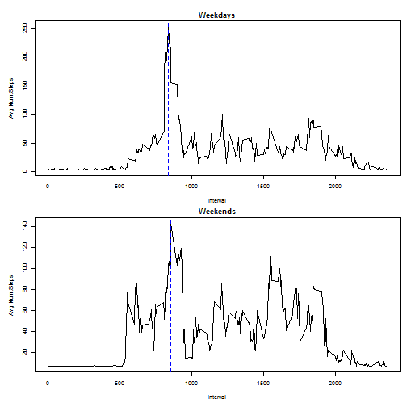

# Peer Assessment #1
## MMCJ - 17/08/2014
========================================================

Loading and preprocessing the data

The data for this assignment refers to Movement Measure

    Dataset: Activity monitoring data [52K]

The variables included in this dataset are:

    1. steps: Number of steps taking in a 5-minute interval (missing values are coded as NA)

    2. date: The date on which the measurement was taken in YYYY-MM-DD format

    3. interval: Identifier for the 5-minute interval in which measurement was taken

The dataset is stored in a comma-separated-value (CSV) file and there are a total of 17,568 observations in this dataset.

# TO BE REMOVED
setwd("c:/Users/Moacyr/Dropbox/week2_reproducibleResearch/RepData_PeerAssessment1/activity")

Setting the data directory

```r
opts_knit$set(root.dir = "c:/Users/Moacyr/Dropbox/week2_reproducibleResearch/RepData_PeerAssessment1/activity")
```


Reading data

```r
activity <- read.csv("activity.csv", header = TRUE, colClasses = c("integer", 
    "character", "integer"))
```

 
Cleaning data, removing all "NA" data

```r
activityCleaned <- subset(activity, steps != "NA")
head(activityCleaned)
```

```
##     steps       date interval
## 289     0 2012-10-02        0
## 290     0 2012-10-02        5
## 291     0 2012-10-02       10
## 292     0 2012-10-02       15
## 293     0 2012-10-02       20
## 294     0 2012-10-02       25
```


# What is mean total number of steps taken per day?

For this part of the assignment, you can ignore the missing values in the dataset.

  ## Make a histogram of the total number of steps taken each day

  ## Calculate and report the mean and median total number of steps taken per day
   
The Histogram   

```r
hist(activity$steps, main = "Histogram\n Number of Steps", col = "red")
```

 


Calculating Mean and Median of steps taken per day

```r
resultMean <- aggregate(activityCleaned$steps ~ activityCleaned$date, FUN = mean, 
    data = activityCleaned)
resultMedian <- aggregate(activityCleaned$steps ~ activityCleaned$date, FUN = median, 
    data = activityCleaned)
FinalResult <- data.frame(cbind(resultMean, resultMedian[, 2]))
names(FinalResult) <- c("Date", "Mean", "Median")
library(xtable)
```

```
## Warning: package 'xtable' was built under R version 2.15.3
```

```r
xt <- xtable(FinalResult)
print(xt, type = "html")
```

<!-- html table generated in R 2.15.0 by xtable 1.7-3 package -->
<!-- Wed Aug 13 16:49:53 2014 -->
<TABLE border=1>
<TR> <TH>  </TH> <TH> Date </TH> <TH> Mean </TH> <TH> Median </TH>  </TR>
  <TR> <TD align="right"> 1 </TD> <TD> 2012-10-02 </TD> <TD align="right"> 0.44 </TD> <TD align="right"> 0.00 </TD> </TR>
  <TR> <TD align="right"> 2 </TD> <TD> 2012-10-03 </TD> <TD align="right"> 39.42 </TD> <TD align="right"> 0.00 </TD> </TR>
  <TR> <TD align="right"> 3 </TD> <TD> 2012-10-04 </TD> <TD align="right"> 42.07 </TD> <TD align="right"> 0.00 </TD> </TR>
  <TR> <TD align="right"> 4 </TD> <TD> 2012-10-05 </TD> <TD align="right"> 46.16 </TD> <TD align="right"> 0.00 </TD> </TR>
  <TR> <TD align="right"> 5 </TD> <TD> 2012-10-06 </TD> <TD align="right"> 53.54 </TD> <TD align="right"> 0.00 </TD> </TR>
  <TR> <TD align="right"> 6 </TD> <TD> 2012-10-07 </TD> <TD align="right"> 38.25 </TD> <TD align="right"> 0.00 </TD> </TR>
  <TR> <TD align="right"> 7 </TD> <TD> 2012-10-09 </TD> <TD align="right"> 44.48 </TD> <TD align="right"> 0.00 </TD> </TR>
  <TR> <TD align="right"> 8 </TD> <TD> 2012-10-10 </TD> <TD align="right"> 34.38 </TD> <TD align="right"> 0.00 </TD> </TR>
  <TR> <TD align="right"> 9 </TD> <TD> 2012-10-11 </TD> <TD align="right"> 35.78 </TD> <TD align="right"> 0.00 </TD> </TR>
  <TR> <TD align="right"> 10 </TD> <TD> 2012-10-12 </TD> <TD align="right"> 60.35 </TD> <TD align="right"> 0.00 </TD> </TR>
  <TR> <TD align="right"> 11 </TD> <TD> 2012-10-13 </TD> <TD align="right"> 43.15 </TD> <TD align="right"> 0.00 </TD> </TR>
  <TR> <TD align="right"> 12 </TD> <TD> 2012-10-14 </TD> <TD align="right"> 52.42 </TD> <TD align="right"> 0.00 </TD> </TR>
  <TR> <TD align="right"> 13 </TD> <TD> 2012-10-15 </TD> <TD align="right"> 35.20 </TD> <TD align="right"> 0.00 </TD> </TR>
  <TR> <TD align="right"> 14 </TD> <TD> 2012-10-16 </TD> <TD align="right"> 52.38 </TD> <TD align="right"> 0.00 </TD> </TR>
  <TR> <TD align="right"> 15 </TD> <TD> 2012-10-17 </TD> <TD align="right"> 46.71 </TD> <TD align="right"> 0.00 </TD> </TR>
  <TR> <TD align="right"> 16 </TD> <TD> 2012-10-18 </TD> <TD align="right"> 34.92 </TD> <TD align="right"> 0.00 </TD> </TR>
  <TR> <TD align="right"> 17 </TD> <TD> 2012-10-19 </TD> <TD align="right"> 41.07 </TD> <TD align="right"> 0.00 </TD> </TR>
  <TR> <TD align="right"> 18 </TD> <TD> 2012-10-20 </TD> <TD align="right"> 36.09 </TD> <TD align="right"> 0.00 </TD> </TR>
  <TR> <TD align="right"> 19 </TD> <TD> 2012-10-21 </TD> <TD align="right"> 30.63 </TD> <TD align="right"> 0.00 </TD> </TR>
  <TR> <TD align="right"> 20 </TD> <TD> 2012-10-22 </TD> <TD align="right"> 46.74 </TD> <TD align="right"> 0.00 </TD> </TR>
  <TR> <TD align="right"> 21 </TD> <TD> 2012-10-23 </TD> <TD align="right"> 30.97 </TD> <TD align="right"> 0.00 </TD> </TR>
  <TR> <TD align="right"> 22 </TD> <TD> 2012-10-24 </TD> <TD align="right"> 29.01 </TD> <TD align="right"> 0.00 </TD> </TR>
  <TR> <TD align="right"> 23 </TD> <TD> 2012-10-25 </TD> <TD align="right"> 8.65 </TD> <TD align="right"> 0.00 </TD> </TR>
  <TR> <TD align="right"> 24 </TD> <TD> 2012-10-26 </TD> <TD align="right"> 23.53 </TD> <TD align="right"> 0.00 </TD> </TR>
  <TR> <TD align="right"> 25 </TD> <TD> 2012-10-27 </TD> <TD align="right"> 35.14 </TD> <TD align="right"> 0.00 </TD> </TR>
  <TR> <TD align="right"> 26 </TD> <TD> 2012-10-28 </TD> <TD align="right"> 39.78 </TD> <TD align="right"> 0.00 </TD> </TR>
  <TR> <TD align="right"> 27 </TD> <TD> 2012-10-29 </TD> <TD align="right"> 17.42 </TD> <TD align="right"> 0.00 </TD> </TR>
  <TR> <TD align="right"> 28 </TD> <TD> 2012-10-30 </TD> <TD align="right"> 34.09 </TD> <TD align="right"> 0.00 </TD> </TR>
  <TR> <TD align="right"> 29 </TD> <TD> 2012-10-31 </TD> <TD align="right"> 53.52 </TD> <TD align="right"> 0.00 </TD> </TR>
  <TR> <TD align="right"> 30 </TD> <TD> 2012-11-02 </TD> <TD align="right"> 36.81 </TD> <TD align="right"> 0.00 </TD> </TR>
  <TR> <TD align="right"> 31 </TD> <TD> 2012-11-03 </TD> <TD align="right"> 36.70 </TD> <TD align="right"> 0.00 </TD> </TR>
  <TR> <TD align="right"> 32 </TD> <TD> 2012-11-05 </TD> <TD align="right"> 36.25 </TD> <TD align="right"> 0.00 </TD> </TR>
  <TR> <TD align="right"> 33 </TD> <TD> 2012-11-06 </TD> <TD align="right"> 28.94 </TD> <TD align="right"> 0.00 </TD> </TR>
  <TR> <TD align="right"> 34 </TD> <TD> 2012-11-07 </TD> <TD align="right"> 44.73 </TD> <TD align="right"> 0.00 </TD> </TR>
  <TR> <TD align="right"> 35 </TD> <TD> 2012-11-08 </TD> <TD align="right"> 11.18 </TD> <TD align="right"> 0.00 </TD> </TR>
  <TR> <TD align="right"> 36 </TD> <TD> 2012-11-11 </TD> <TD align="right"> 43.78 </TD> <TD align="right"> 0.00 </TD> </TR>
  <TR> <TD align="right"> 37 </TD> <TD> 2012-11-12 </TD> <TD align="right"> 37.38 </TD> <TD align="right"> 0.00 </TD> </TR>
  <TR> <TD align="right"> 38 </TD> <TD> 2012-11-13 </TD> <TD align="right"> 25.47 </TD> <TD align="right"> 0.00 </TD> </TR>
  <TR> <TD align="right"> 39 </TD> <TD> 2012-11-15 </TD> <TD align="right"> 0.14 </TD> <TD align="right"> 0.00 </TD> </TR>
  <TR> <TD align="right"> 40 </TD> <TD> 2012-11-16 </TD> <TD align="right"> 18.89 </TD> <TD align="right"> 0.00 </TD> </TR>
  <TR> <TD align="right"> 41 </TD> <TD> 2012-11-17 </TD> <TD align="right"> 49.79 </TD> <TD align="right"> 0.00 </TD> </TR>
  <TR> <TD align="right"> 42 </TD> <TD> 2012-11-18 </TD> <TD align="right"> 52.47 </TD> <TD align="right"> 0.00 </TD> </TR>
  <TR> <TD align="right"> 43 </TD> <TD> 2012-11-19 </TD> <TD align="right"> 30.70 </TD> <TD align="right"> 0.00 </TD> </TR>
  <TR> <TD align="right"> 44 </TD> <TD> 2012-11-20 </TD> <TD align="right"> 15.53 </TD> <TD align="right"> 0.00 </TD> </TR>
  <TR> <TD align="right"> 45 </TD> <TD> 2012-11-21 </TD> <TD align="right"> 44.40 </TD> <TD align="right"> 0.00 </TD> </TR>
  <TR> <TD align="right"> 46 </TD> <TD> 2012-11-22 </TD> <TD align="right"> 70.93 </TD> <TD align="right"> 0.00 </TD> </TR>
  <TR> <TD align="right"> 47 </TD> <TD> 2012-11-23 </TD> <TD align="right"> 73.59 </TD> <TD align="right"> 0.00 </TD> </TR>
  <TR> <TD align="right"> 48 </TD> <TD> 2012-11-24 </TD> <TD align="right"> 50.27 </TD> <TD align="right"> 0.00 </TD> </TR>
  <TR> <TD align="right"> 49 </TD> <TD> 2012-11-25 </TD> <TD align="right"> 41.09 </TD> <TD align="right"> 0.00 </TD> </TR>
  <TR> <TD align="right"> 50 </TD> <TD> 2012-11-26 </TD> <TD align="right"> 38.76 </TD> <TD align="right"> 0.00 </TD> </TR>
  <TR> <TD align="right"> 51 </TD> <TD> 2012-11-27 </TD> <TD align="right"> 47.38 </TD> <TD align="right"> 0.00 </TD> </TR>
  <TR> <TD align="right"> 52 </TD> <TD> 2012-11-28 </TD> <TD align="right"> 35.36 </TD> <TD align="right"> 0.00 </TD> </TR>
  <TR> <TD align="right"> 53 </TD> <TD> 2012-11-29 </TD> <TD align="right"> 24.47 </TD> <TD align="right"> 0.00 </TD> </TR>
   </TABLE>

 
# What is the average daily activity pattern?

    Make a time series plot (i.e. type = "l") of the 5-minute interval (x-axis) and the average number of steps taken, averaged across all days (y-axis)

    Which 5-minute interval, on average across all the days in the dataset, contains the maximum number of steps?


```r
teste <- aggregate(activity$steps ~ activity$interval, FUN = mean, data = activity)
plot(teste[, 1], teste[, 2], type = "l", main = "Time Series \nAverage # steps VS 5-minute interval", 
    ylab = "Avg # of steps", xlab = "5-min interval")
abline(v = teste[teste[, 2] == max(teste[, 2]), ][1], col = "blue", lty = 2, 
    lwd = 1)
text(teste[teste[, 2] == max(teste[, 2]), ][1], 200, teste[teste[, 2] == max(teste[, 
    2]), ][1], pos = 4)
```

 

```r
paste("The maximum number of avg step are obtained in Time interval:", teste[teste[, 
    2] == max(teste[, 2]), ][1])
```

```
## [1] "The maximum number of avg step are obtained in Time interval: 835"
```


# Imputing missing values

Note that there are a number of days/intervals where there are missing values (coded as NA). The presence of missing days may introduce bias into some calculations or summaries of the data.

    Calculate and report the total number of missing values in the dataset (i.e. the total number of rows with NAs)

    Devise a strategy for filling in all of the missing values in the dataset. The strategy does not need to be sophisticated. For example, you could use the mean/median for that day, or the mean for that 5-minute interval, etc.

    Create a new dataset that is equal to the original dataset but with the missing data filled in.

    Make a histogram of the total number of steps taken each day and 
    Calculate and report the mean and median total number of steps taken per day. 
    Do these values differ from the estimates from the first part of the assignment?
    What is the impact of imputing missing data on the estimates of the total daily number of steps?

obtaining the total # of NA´s

```r
total <- sum(is.na(activity$steps))
```

 
The number of NA in our archive is 2304.
 
The strategy to fill in all missing values will a global Mean

```r
stepsFilled <- replace(activity$steps, is.na(activity$steps), mean(activity$steps, 
    na.rm = TRUE))
newActivity <- as.data.frame(cbind(as.numeric(stepsFilled), activity$date, activity$interval))
names(newActivity) <- c("stepFilled", "Date", "interval")
head(newActivity)
```

```
##         stepFilled       Date interval
## 1 37.3825995807128 2012-10-01        0
## 2 37.3825995807128 2012-10-01        5
## 3 37.3825995807128 2012-10-01       10
## 4 37.3825995807128 2012-10-01       15
## 5 37.3825995807128 2012-10-01       20
## 6 37.3825995807128 2012-10-01       25
```

str(newActivity)
Histogram of the New filled archive

```r
hist(as.numeric(newActivity[, 1]), main = "Histogram\n Number of Steps\n filled by global Mean", 
    xlab = "# of Steps", col = "blue")
```

 


calculating and reporting new mean and median

```r
resultMeanF <- aggregate(as.numeric(newActivity[, 1]) ~ newActivity[, 2], FUN = mean, 
    data = newActivity)
resultMedianF <- aggregate(as.numeric(newActivity[, 1]) ~ newActivity[, 2], 
    FUN = median, data = newActivity)
FinalResultF <- data.frame(cbind(resultMeanF, resultMedianF[, 2]))
names(FinalResultF) <- c("Date", "Mean", "Median")
library(xtable)
xtF <- xtable(FinalResultF)
print(xtF, type = "html")
```

<!-- html table generated in R 2.15.0 by xtable 1.7-3 package -->
<!-- Wed Aug 13 16:49:54 2014 -->
<TABLE border=1>
<TR> <TH>  </TH> <TH> Date </TH> <TH> Mean </TH> <TH> Median </TH>  </TR>
  <TR> <TD align="right"> 1 </TD> <TD> 2012-10-01 </TD> <TD align="right"> 276.00 </TD> <TD align="right"> 276.00 </TD> </TR>
  <TR> <TD align="right"> 2 </TD> <TD> 2012-10-02 </TD> <TD align="right"> 3.18 </TD> <TD align="right"> 1.00 </TD> </TR>
  <TR> <TD align="right"> 3 </TD> <TD> 2012-10-03 </TD> <TD align="right"> 89.37 </TD> <TD align="right"> 1.00 </TD> </TR>
  <TR> <TD align="right"> 4 </TD> <TD> 2012-10-04 </TD> <TD align="right"> 102.04 </TD> <TD align="right"> 1.00 </TD> </TR>
  <TR> <TD align="right"> 5 </TD> <TD> 2012-10-05 </TD> <TD align="right"> 89.16 </TD> <TD align="right"> 1.00 </TD> </TR>
  <TR> <TD align="right"> 6 </TD> <TD> 2012-10-06 </TD> <TD align="right"> 108.61 </TD> <TD align="right"> 1.00 </TD> </TR>
  <TR> <TD align="right"> 7 </TD> <TD> 2012-10-07 </TD> <TD align="right"> 104.69 </TD> <TD align="right"> 1.00 </TD> </TR>
  <TR> <TD align="right"> 8 </TD> <TD> 2012-10-08 </TD> <TD align="right"> 276.00 </TD> <TD align="right"> 276.00 </TD> </TR>
  <TR> <TD align="right"> 9 </TD> <TD> 2012-10-09 </TD> <TD align="right"> 89.26 </TD> <TD align="right"> 1.00 </TD> </TR>
  <TR> <TD align="right"> 10 </TD> <TD> 2012-10-10 </TD> <TD align="right"> 99.79 </TD> <TD align="right"> 1.00 </TD> </TR>
  <TR> <TD align="right"> 11 </TD> <TD> 2012-10-11 </TD> <TD align="right"> 82.66 </TD> <TD align="right"> 1.00 </TD> </TR>
  <TR> <TD align="right"> 12 </TD> <TD> 2012-10-12 </TD> <TD align="right"> 122.12 </TD> <TD align="right"> 1.00 </TD> </TR>
  <TR> <TD align="right"> 13 </TD> <TD> 2012-10-13 </TD> <TD align="right"> 112.51 </TD> <TD align="right"> 1.00 </TD> </TR>
  <TR> <TD align="right"> 14 </TD> <TD> 2012-10-14 </TD> <TD align="right"> 102.25 </TD> <TD align="right"> 1.00 </TD> </TR>
  <TR> <TD align="right"> 15 </TD> <TD> 2012-10-15 </TD> <TD align="right"> 92.88 </TD> <TD align="right"> 1.00 </TD> </TR>
  <TR> <TD align="right"> 16 </TD> <TD> 2012-10-16 </TD> <TD align="right"> 100.09 </TD> <TD align="right"> 1.00 </TD> </TR>
  <TR> <TD align="right"> 17 </TD> <TD> 2012-10-17 </TD> <TD align="right"> 97.22 </TD> <TD align="right"> 1.00 </TD> </TR>
  <TR> <TD align="right"> 18 </TD> <TD> 2012-10-18 </TD> <TD align="right"> 70.66 </TD> <TD align="right"> 1.00 </TD> </TR>
  <TR> <TD align="right"> 19 </TD> <TD> 2012-10-19 </TD> <TD align="right"> 93.37 </TD> <TD align="right"> 1.00 </TD> </TR>
  <TR> <TD align="right"> 20 </TD> <TD> 2012-10-20 </TD> <TD align="right"> 89.61 </TD> <TD align="right"> 1.00 </TD> </TR>
  <TR> <TD align="right"> 21 </TD> <TD> 2012-10-21 </TD> <TD align="right"> 90.13 </TD> <TD align="right"> 1.00 </TD> </TR>
  <TR> <TD align="right"> 22 </TD> <TD> 2012-10-22 </TD> <TD align="right"> 90.33 </TD> <TD align="right"> 1.00 </TD> </TR>
  <TR> <TD align="right"> 23 </TD> <TD> 2012-10-23 </TD> <TD align="right"> 82.43 </TD> <TD align="right"> 1.00 </TD> </TR>
  <TR> <TD align="right"> 24 </TD> <TD> 2012-10-24 </TD> <TD align="right"> 80.40 </TD> <TD align="right"> 1.00 </TD> </TR>
  <TR> <TD align="right"> 25 </TD> <TD> 2012-10-25 </TD> <TD align="right"> 46.09 </TD> <TD align="right"> 1.00 </TD> </TR>
  <TR> <TD align="right"> 26 </TD> <TD> 2012-10-26 </TD> <TD align="right"> 66.20 </TD> <TD align="right"> 1.00 </TD> </TR>
  <TR> <TD align="right"> 27 </TD> <TD> 2012-10-27 </TD> <TD align="right"> 71.20 </TD> <TD align="right"> 1.00 </TD> </TR>
  <TR> <TD align="right"> 28 </TD> <TD> 2012-10-28 </TD> <TD align="right"> 102.71 </TD> <TD align="right"> 1.00 </TD> </TR>
  <TR> <TD align="right"> 29 </TD> <TD> 2012-10-29 </TD> <TD align="right"> 62.78 </TD> <TD align="right"> 1.00 </TD> </TR>
  <TR> <TD align="right"> 30 </TD> <TD> 2012-10-30 </TD> <TD align="right"> 82.85 </TD> <TD align="right"> 1.00 </TD> </TR>
  <TR> <TD align="right"> 31 </TD> <TD> 2012-10-31 </TD> <TD align="right"> 90.76 </TD> <TD align="right"> 1.00 </TD> </TR>
  <TR> <TD align="right"> 32 </TD> <TD> 2012-11-01 </TD> <TD align="right"> 276.00 </TD> <TD align="right"> 276.00 </TD> </TR>
  <TR> <TD align="right"> 33 </TD> <TD> 2012-11-02 </TD> <TD align="right"> 84.10 </TD> <TD align="right"> 1.00 </TD> </TR>
  <TR> <TD align="right"> 34 </TD> <TD> 2012-11-03 </TD> <TD align="right"> 98.86 </TD> <TD align="right"> 1.00 </TD> </TR>
  <TR> <TD align="right"> 35 </TD> <TD> 2012-11-04 </TD> <TD align="right"> 276.00 </TD> <TD align="right"> 276.00 </TD> </TR>
  <TR> <TD align="right"> 36 </TD> <TD> 2012-11-05 </TD> <TD align="right"> 80.40 </TD> <TD align="right"> 1.00 </TD> </TR>
  <TR> <TD align="right"> 37 </TD> <TD> 2012-11-06 </TD> <TD align="right"> 75.53 </TD> <TD align="right"> 1.00 </TD> </TR>
  <TR> <TD align="right"> 38 </TD> <TD> 2012-11-07 </TD> <TD align="right"> 89.99 </TD> <TD align="right"> 1.00 </TD> </TR>
  <TR> <TD align="right"> 39 </TD> <TD> 2012-11-08 </TD> <TD align="right"> 55.75 </TD> <TD align="right"> 1.00 </TD> </TR>
  <TR> <TD align="right"> 40 </TD> <TD> 2012-11-09 </TD> <TD align="right"> 276.00 </TD> <TD align="right"> 276.00 </TD> </TR>
  <TR> <TD align="right"> 41 </TD> <TD> 2012-11-10 </TD> <TD align="right"> 276.00 </TD> <TD align="right"> 276.00 </TD> </TR>
  <TR> <TD align="right"> 42 </TD> <TD> 2012-11-11 </TD> <TD align="right"> 103.40 </TD> <TD align="right"> 1.00 </TD> </TR>
  <TR> <TD align="right"> 43 </TD> <TD> 2012-11-12 </TD> <TD align="right"> 67.35 </TD> <TD align="right"> 1.00 </TD> </TR>
  <TR> <TD align="right"> 44 </TD> <TD> 2012-11-13 </TD> <TD align="right"> 83.02 </TD> <TD align="right"> 1.00 </TD> </TR>
  <TR> <TD align="right"> 45 </TD> <TD> 2012-11-14 </TD> <TD align="right"> 276.00 </TD> <TD align="right"> 276.00 </TD> </TR>
  <TR> <TD align="right"> 46 </TD> <TD> 2012-11-15 </TD> <TD align="right"> 3.89 </TD> <TD align="right"> 1.00 </TD> </TR>
  <TR> <TD align="right"> 47 </TD> <TD> 2012-11-16 </TD> <TD align="right"> 58.62 </TD> <TD align="right"> 1.00 </TD> </TR>
  <TR> <TD align="right"> 48 </TD> <TD> 2012-11-17 </TD> <TD align="right"> 90.94 </TD> <TD align="right"> 1.00 </TD> </TR>
  <TR> <TD align="right"> 49 </TD> <TD> 2012-11-18 </TD> <TD align="right"> 98.79 </TD> <TD align="right"> 1.00 </TD> </TR>
  <TR> <TD align="right"> 50 </TD> <TD> 2012-11-19 </TD> <TD align="right"> 82.94 </TD> <TD align="right"> 1.00 </TD> </TR>
  <TR> <TD align="right"> 51 </TD> <TD> 2012-11-20 </TD> <TD align="right"> 44.35 </TD> <TD align="right"> 1.00 </TD> </TR>
  <TR> <TD align="right"> 52 </TD> <TD> 2012-11-21 </TD> <TD align="right"> 77.59 </TD> <TD align="right"> 1.00 </TD> </TR>
  <TR> <TD align="right"> 53 </TD> <TD> 2012-11-22 </TD> <TD align="right"> 120.01 </TD> <TD align="right"> 1.00 </TD> </TR>
  <TR> <TD align="right"> 54 </TD> <TD> 2012-11-23 </TD> <TD align="right"> 92.35 </TD> <TD align="right"> 1.00 </TD> </TR>
  <TR> <TD align="right"> 55 </TD> <TD> 2012-11-24 </TD> <TD align="right"> 85.18 </TD> <TD align="right"> 1.00 </TD> </TR>
  <TR> <TD align="right"> 56 </TD> <TD> 2012-11-25 </TD> <TD align="right"> 81.47 </TD> <TD align="right"> 1.00 </TD> </TR>
  <TR> <TD align="right"> 57 </TD> <TD> 2012-11-26 </TD> <TD align="right"> 100.23 </TD> <TD align="right"> 1.00 </TD> </TR>
  <TR> <TD align="right"> 58 </TD> <TD> 2012-11-27 </TD> <TD align="right"> 90.31 </TD> <TD align="right"> 1.00 </TD> </TR>
  <TR> <TD align="right"> 59 </TD> <TD> 2012-11-28 </TD> <TD align="right"> 55.67 </TD> <TD align="right"> 1.00 </TD> </TR>
  <TR> <TD align="right"> 60 </TD> <TD> 2012-11-29 </TD> <TD align="right"> 60.18 </TD> <TD align="right"> 1.00 </TD> </TR>
  <TR> <TD align="right"> 61 </TD> <TD> 2012-11-30 </TD> <TD align="right"> 276.00 </TD> <TD align="right"> 276.00 </TD> </TR>
   </TABLE>


# Are there differences in activity patterns between weekdays and weekends?

For this part the weekdays() function may be of some help here. Use the dataset with the filled-in missing values for this part.

    Create a new factor variable in the dataset with two levels - "weekday" and "weekend" indicating whether a given date is a weekday or weekend day.

    Make a panel plot containing a time series plot (i.e. type = "l") of the 5-minute interval (x-axis) and the average number of steps taken, averaged across all weekday days or weekend days (y-axis). The plot should look something like the following, which was creating using simulated data:


Creating a factor vector and subsets the original archive into weekdays and weekends in order to generate the
comparative panel


```r
# Create a fVector, since 1:9504 are weekdays, and the others are weekends
fVector <- c(rep("weekday", 9504), rep("weekend", 8064))
newActivity[, 3] <- as.numeric(as.character(newActivity[, 3]))
newActivity[, 2] <- as.Date(as.character(newActivity[, 2]))
newActivity[, 1] <- as.numeric(as.character(newActivity[, 1]))
newDataFrameF <- as.data.frame(cbind(newActivity, fVector))
# Creates 2 subsets, one for each 'weekday' or 'weekend'
newDataFrameWeekdays <- subset(newDataFrameF, fVector == "weekday")
newDataFrameWeekends <- subset(newDataFrameF, fVector == "weekend")
avgweekdays <- aggregate(stepFilled ~ interval, FUN = mean, data = newDataFrameWeekdays)
avgweekends <- aggregate(stepFilled ~ interval, FUN = mean, data = newDataFrameWeekends)
# Graphics set up
par(mfrow = c(2, 1))
par(cex = 0.6)
par(mar = c(4, 4, 2, 0), oma = c(1, 1, 1, 1))
with(avgweekdays, plot(interval, stepFilled, type = "l", main = "Weekdays", 
    ylab = "Avg Num.Steps"))
abline(v = avgweekdays[avgweekdays[, 2] == max(avgweekdays[, 2]), ][1], col = "blue", 
    lty = 2, lwd = 1)
with(avgweekends, plot(interval, stepFilled, type = "l", main = "Weekends", 
    ylab = "Avg Num.Steps"))
abline(v = avgweekends[avgweekends[, 2] == max(avgweekends[, 2]), ][1], col = "blue", 
    lty = 2, lwd = 1)
```

 


The two patterns are different, although the maximum is very close.

End of Assignment ====================================================================================================
